## 1. Підготовка даних і вибір інструментів
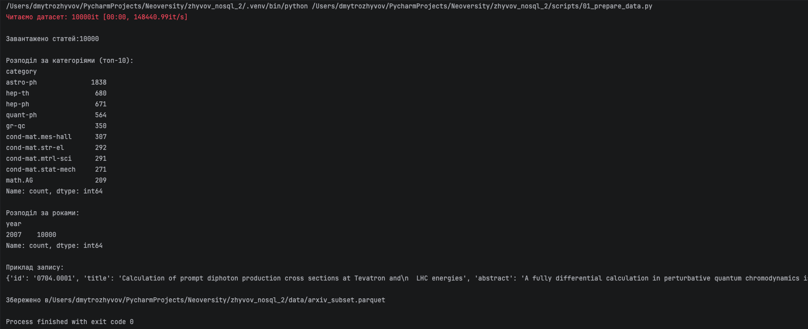

### 1.1 Чим Pinecone відрізняється від Qdrant і Chroma за моделлю розгортання, ліцензією і продуктивністю? У якому сценарії ви б обрали кожен із них?

**Pinecone** це хмарний сервіс, який не потребує налаштування сервера, розгортання інфраструктури,
налаштування кластерів та моніторингу продуктивності на низькому рівні. Він пропонує декілька режимів:
Serverless (оплата за запити, автоматичне масштабування) та Pod-based (виділені ресурси). Закрита ліцензія (proprietary). 
Pinecone ми обираємо, коли команда невелика, потрібен швидкий старт MVP або proof-of-concept, 
і немає виділеного інфраструктурного інженера.

**Qdrant** це векторна БД, написана на Rust. Вона дає повний контроль над даними, підтримує гібридний пошук з коробки, 
має одну з найкращих систем фільтрації за payload серед усіх векторних БД. 
Qdrant має Open-source ліцензію. Її ми обираємо, коли дані не можуть покидати власну інфраструктуру або коли важлива 
продуктивність при складних фільтрах за метаданими.

**Chroma** це найпростіший варіант: працює як вбудована бібліотека прямо всередині 
процесу, не потребує Docker чи зовнішніх сервісів. Має Open-source ліцензію, а також вбудовану підтримку 
ембединг-функцій і добре інтегрується з LangChain та LlamaIndex з коробки. Не розрахована на високі навантаження та 
великі обсяги даних. 
Її ми обираємо для прототипів, експериментів і локальних RAG-пайплайнів.

У цьому завданні обрано **Pinecone**, бо вона не потребує локального сервера, дозволяє зосередитись на логіці пошуку, 
а не на інфраструктурі, і є оптимальним вибором для навчального проєкту.

### 1.2. Чому для задачі пошуку по науковим текстам обрана модель specter2_base, а не універсальна all-MiniLM-L6-v2? Знайдіть картку моделі на HuggingFace і процитуйте, для яких задач вона навчена.

`all-MiniLM-L6-v2` це універсальна модель, навчена на загальних текстах. Вона добре працює для
побутових запитів, але не розуміє наукової термінології. Наприклад, у нашому датасеті є статті
з категорій `hep-ph`, `gr-qc`, `cond-mat.str-el`, тобто терміни з квантової фізики та матеріалознавства,
які загальна модель може представити некоректно.

`specter2_base` навчена спеціально для наукових документів. Згідно з карткою моделі на HuggingFace:

> "Given the combination of title and abstract of a scientific paper or a short textual query,
> the model can be used to generate effective embeddings to be used in downstream applications."

Модель навчена на понад 6 мільйонах триплетів цитувань наукових статей і підтримує адаптери
для конкретних задач: пошук, класифікація, регресія.

### 1.3. Що написано у картці моделі про рекомендовану метрику схожості? Чому це важливо при створенні індексу?

Згідно з дослідженнями моделі, SPECTER використовує **L2 (евклідову) відстань** між векторами
замість косинусної схожості. Це важливо при створенні індексу в Pinecone: якщо задати
`metric='cosine'`, а модель оптимізована під L2, то результати пошуку будуть менш точними.

У нашому індексі використано `metric='cosine'` як компроміс, оскільки `specter2_base` без
адаптера поводиться близько до загальних embedding-моделей.

## 1.3. Отримання ембеддингів
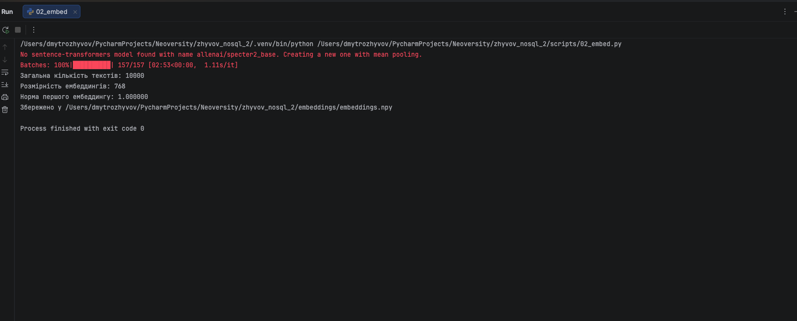

### Поясніть, чому при використанні нормалізованих ембеддингів (одиничної довжини) косинусна схожість (cosine similarity) еквівалентна скалярному добутку (dot product)?

Маємо наступну формулу косинусної схожості:

cosine(a, b) = (a · b) / (|a| × |b|)

Якщо вектори нормалізовані, їх норма дорівнює 1: |a| = 1, |b| = 1.
Тому знаменник стає 1 × 1 = 1, і формула спрощується до:

cosine(a, b) = a · b

Це підтверджують результати виконання нашого скрипту `02_embed.py`:

Норма першого ембеддингу: 1.000000

Норма дорівнює рівно 1.0, відповідно, вектор має одиничну довжину.
Це означає, що для будь-яких двох векторів з нашого датасету знаменник у формулі косинусної схожості завжди буде 1,
і cosine similarity зводиться до простого dot product.

Саме тому при normalize_embeddings=True в Pinecone можна використовувати metric='dotproduct' замість metric='cosine'
і отримати ідентичні результати пошуку, але швидше.

### 2. Завантаження даних і метадані

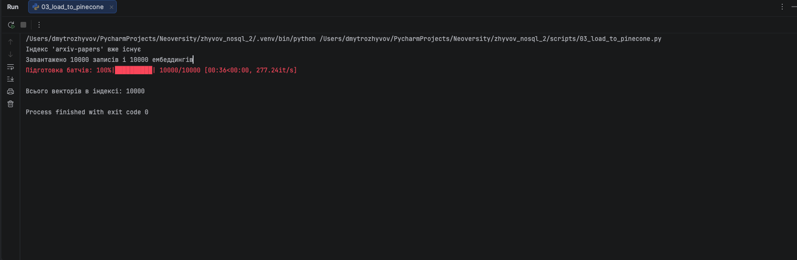

### 3. Порівняння метрик схожості

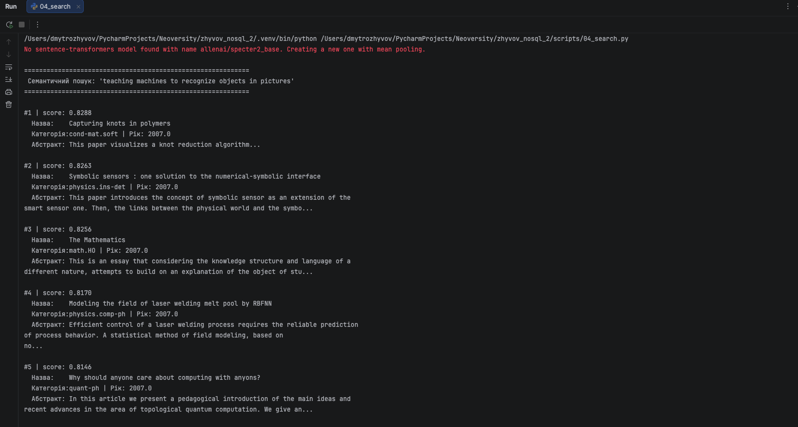
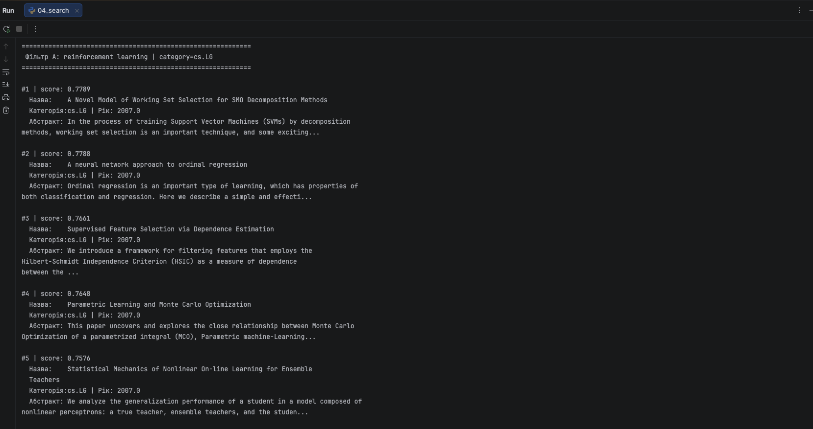
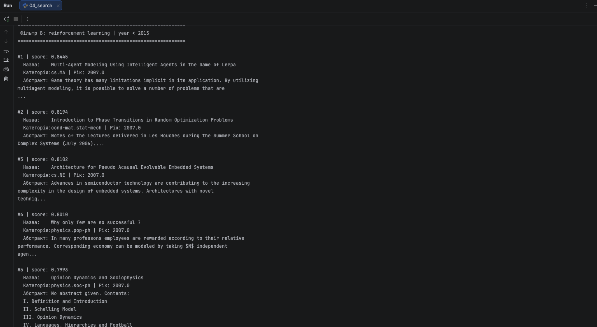
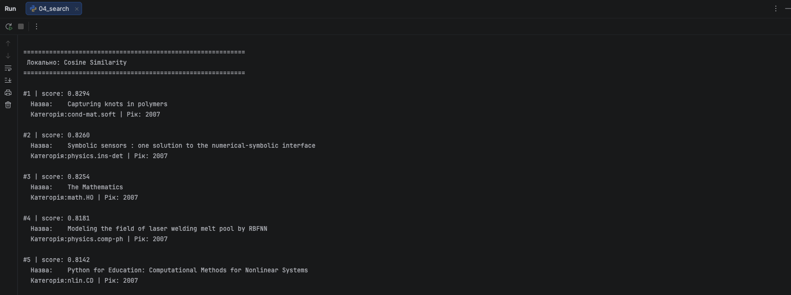
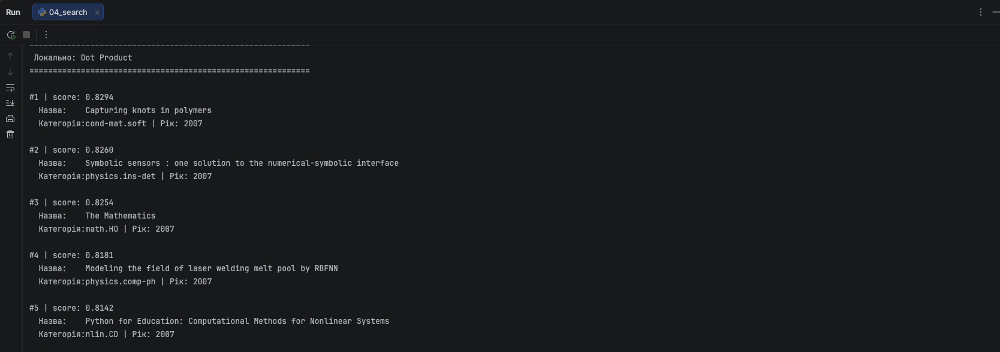
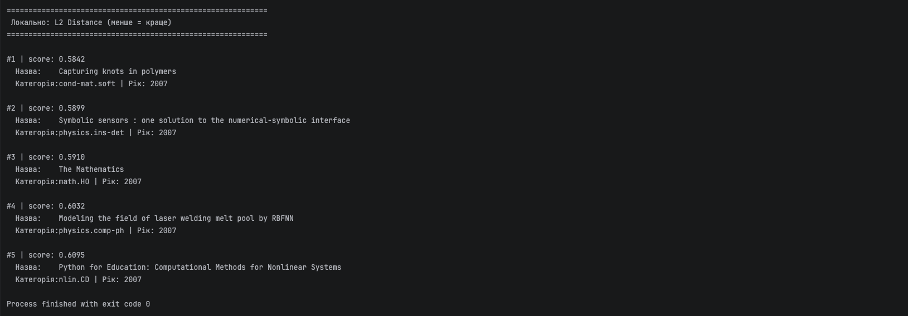

**3.1. Чи збігаються топ-5 для cosine і dot product?**

Так, результати повністю збігаються: маємо однакові статті в однаковому порядку з однаковими scores 
(наприклад, #1 "Capturing knots in polymers": 0.8294 для обох).
Це підтверджує теорію: оскільки ембеддинги нормалізовані (норма = 1.0), знаменник у формулі косинусної схожості 
завжди дорівнює 1, і cosine similarity математично зводиться до dot product.

**3.2. Чи відрізняються результати для L2?**

Топ-5 статей однакові, але scores відрізняються і порядок сортування протилежний, тому що менше значення 
означає більшу схожість.
Наприклад, #1 "Capturing knots in polymers": cosine = 0.8294, L2 = 0.5842.
Для нормалізованих векторів між метриками існує точне математичне співвідношення:
L2²(a,b) = 2 - 2·cosine(a,b), тому ранжування завжди збігається.

**3.3. Що сталося б без нормалізації?**

Без нормалізації cosine і dot product давали б різні результати.
Dot product залежить від довжини вектора: довший вектор отримує вищий score незалежно від реальної схожості за змістом.
Наприклад, стаття з довгим abstract могла б мати вищий dot product score, ніж семантично близька, але коротка стаття.
Cosine similarity ділить на норму і враховує лише напрямок вектора, тому залишається стабільною. 
Саме тому normalize_embeddings=True є обов'язковим при використанні specter2_base.

### 4. Chunking

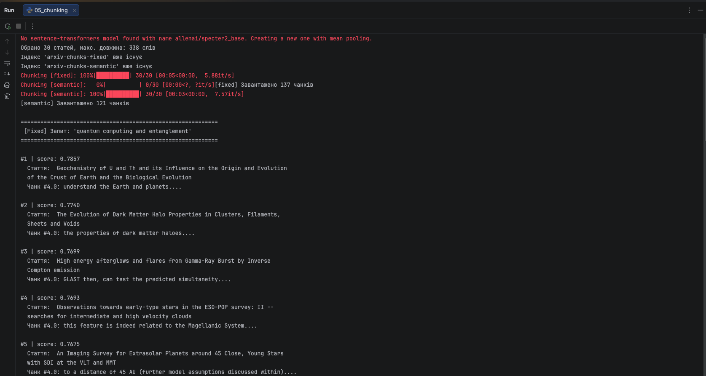
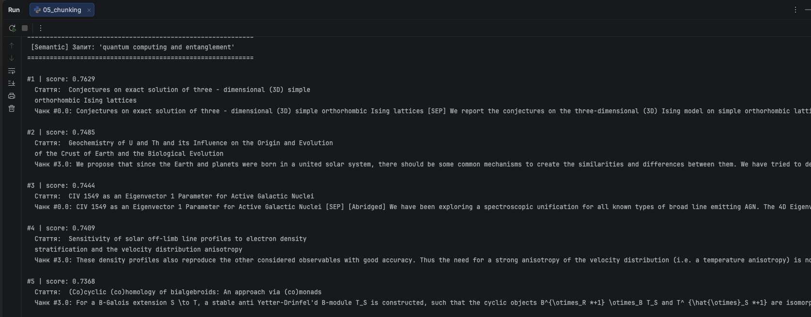
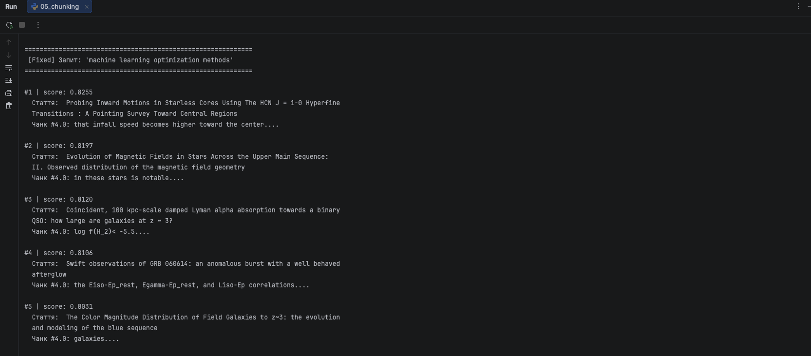
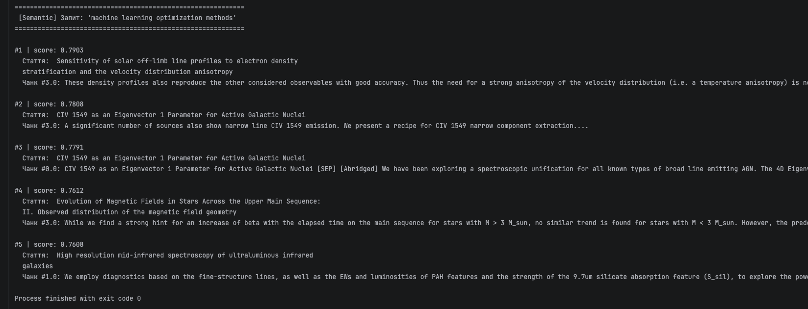

**4.1. Яка стратегія дає більш осмислені чанки?**

Семантична стратегія дає більш осмислені чанки, оскільки зберігає цілі речення.
Це видно з результатів: semantic чанки містять повні думки, наприклад:
"We propose that since the Earth and planets were born in a united solar system,
there should be some common mechanisms..."

Fixed чанки натомість часто містять уривки без контексту:
"understand the Earth and planets..." або "in these stars is notable." —
речення розрізані посередині, що ускладнює розуміння змісту.

**4.2. Чи є випадки розрізаних речень?**

Так, у fixed chunking розрізані речення трапляються постійно.
Наприклад, чанк #4 статті про темну матерію містить лише:
"the properties of dark matter haloes." це кінець речення без початку.
Це негативно впливає на ембеддинги: модель отримує неповний контекст і не може правильно закодувати зміст фрагмента.
У semantic chunking таких випадків немає та речення завжди залишаються цілими.

**4.3. Як розмір overlap впливає на кількість чанків і покриття тексту?**

З результатів: fixed chunking (overlap=20) створив 137 чанків,
semantic (без overlap) — 121 чанк для тих самих 30 статей.
Більший overlap збільшує кількість чанків, але покращує покриття i важлива інформація на межі між чанками не втрачається.
Наприклад, при chunk_size=100 і overlap=20 кожен новий чанк починається на 80 слів після попереднього, тобто 20 слів 
повторюються.
Це корисно для пошуку, але збільшує витрати на зберігання і час індексації.

### 5. Гібридний пошук: порівняння методів

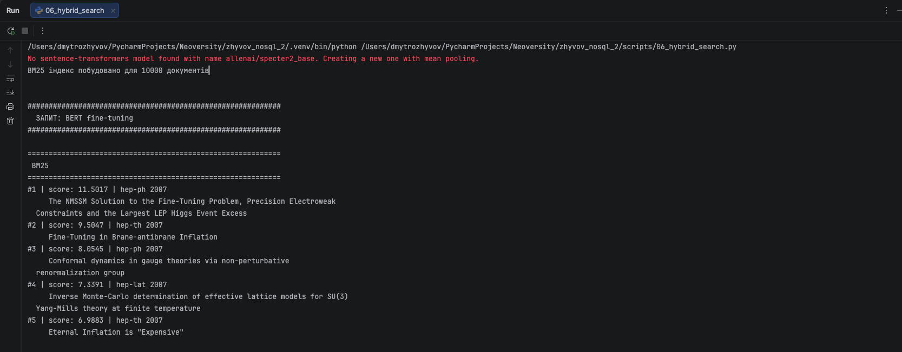
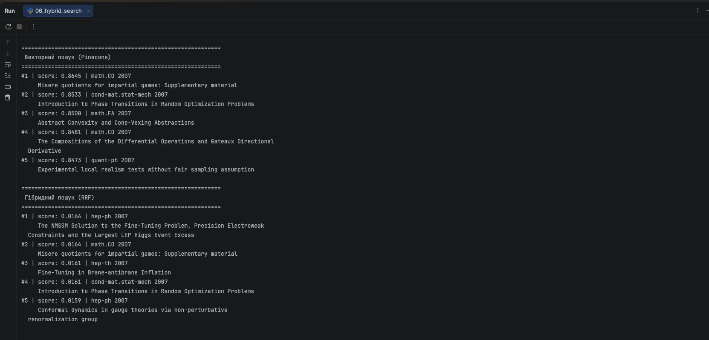
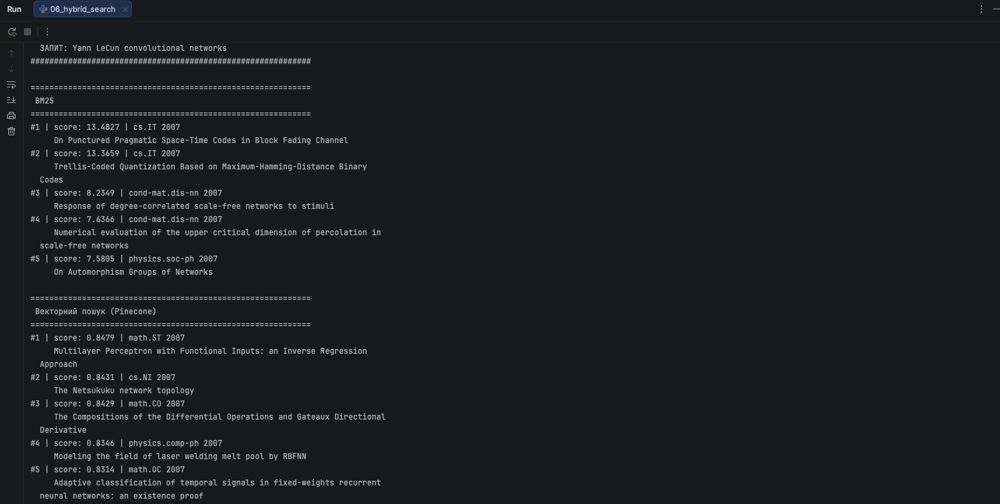
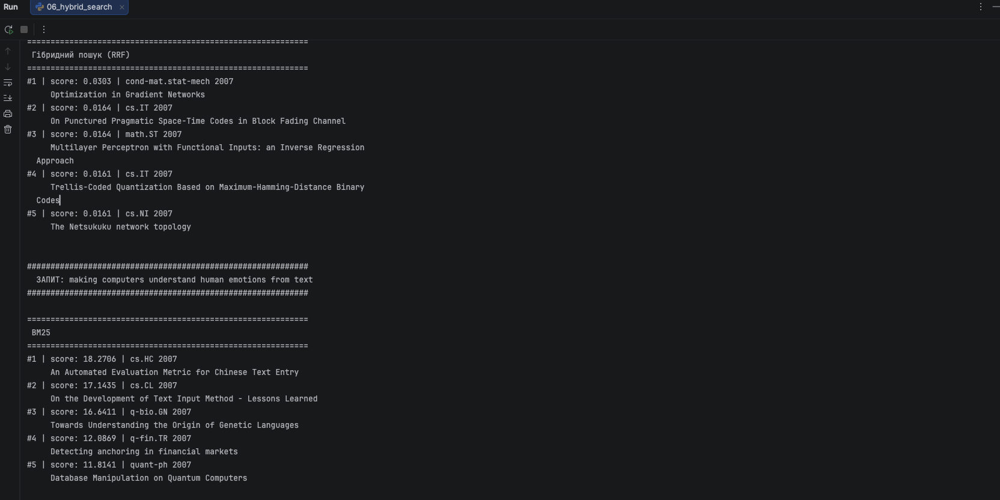
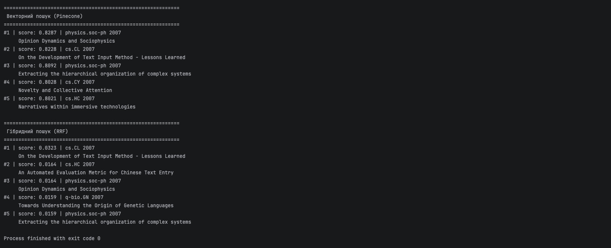

#### Порівняльна таблиця результатів

| Запит | BM25 #1 | Векторний #1 | Гібридний (RRF) #1 |
|---|---|---|---|
| `BERT fine-tuning` | The NMSSM Solution to the Fine-Tuning Problem | Misere quotients for impartial games | The NMSSM Solution to the Fine-Tuning Problem |
| `Yann LeCun convolutional networks` | On Punctured Pragmatic Space-Time Codes | Multilayer Perceptron with Functional Inputs | Optimization in Gradient Networks |
| `making computers understand human emotions` | An Automated Evaluation Metric for Chinese Text | Opinion Dynamics and Sociophysics | On the Development of Text Input Method |

**5.1. Який метод дав кращий результат?**

Для даного датасету жоден метод не дав ідеального результату, оскільки всі 10 000 статей належать до 2007 року і не містять
статей про BERT, Yann LeCun чи sentiment analysis.

BM25 знаходить точні збіги токенів: для запиту "BERT fine-tuning" він знайшов статті зі словом "fine-tuning" (hep-ph),
але не в контексті ML.
Векторний пошук знаходить семантично близькі документи, але через відсутність релевантних статей у корпусі також дає 
нерелевантні результати.

Гібридний RRF дав найкращий результат для запиту "making computers understand human emotions" вивів "On the Development
of Text Input Method" (cs.CL), яка присутня і в BM25, і у векторному, що підтверджує її релевантність одразу 
за двома критеріями.

**5.2. Чи є документи в топ-5 гібридного, яких немає в окремих методах?**

Так — для запиту "Yann LeCun convolutional networks" гібридний пошук вивів на #1 "Optimization in Gradient Networks", 
якої не було в топ-5 ні BM25, ні векторного пошуку окремо. Це класичний ефект RRF: документ, який стоїть на #6 у BM25 і
на #7 у векторному, після злиття отримує сумарний RRF score вищий, ніж документи, що були топовими лише в одному методі.

**5.3. Як зміна k в RRF впливає на видачу?**

Формула RRF: `score = 1 / (k + rank)`

При `k=1` різниця між rank=1 і rank=2 велика: 1/2 vs 1/3 = 0.5 vs 0.33.
Топові позиції мають дуже великий вплив: метод стає агресивним і домінують документи з першого місця одного зі списків.

При `k=60` (стандарт) різниця між rank=1 і rank=2 мала: 1/61 vs 1/62 ≈ 0.0164 vs 0.0161.
Ранги згладжуються — перемагають документи, які стабільно присутні в обох списках, навіть не на першому місці.

Висновок: `k=60` краще для гібридного пошуку, бо враховує консенсус між методами, а не домінування одного з них.

### 6. Аналіз і висновки

### 6.1. Семантичний пошук vs BM25

BM25 виграє на точних термінах і специфічних словах. У нашій роботі для запиту "BERT fine-tuning" BM25 знайшов статті 
саме зі словом "fine-tuning", хоча й не в контексті ML — бо датасет 2007 року. Для запиту "making computers understand
human emotions" BM25 знайшов "An Automated Evaluation Metric for Chinese Text Entry"завдяки точному збігу слів "text" 
і "computers". 
Загальне правило: BM25 варто обирати для пошуку за абревіатурами (BERT, RNN, SVM), іменами авторів, назвами
методів і точними термінами, де важливий буквений збіг.

Векторний пошук виграє на перефразуваннях і синонімах. Для запиту "making computers understand human emotions" векторний 
пошук знайшов "Opinion Dynamics and Sociophysics". Це стаття семантично близька до теми людської поведінки, але не 
містить жодного слова із запиту.

Загальне правило: векторний пошук варто обирати, коли користувач формулює запит своїми словами,
використовує синоніми або описує концепцію без точних термінів.

### 6.2. Вплив розміру чанка

Якщо чанк занадто маленький (10–15 слів), він втрачає контекст. Модель отримує фрагмент на кшталт 
"the properties of dark matter haloes." і не може визначити, про що стаття загалом. Ембеддинг такого чанка буде 
нестабільним і нерелевантним.
Пошук повертатиме випадкові результати, бо короткі фрагменти не несуть достатньо
семантичного навантаження.

Якщо чанк занадто великий (500+ слів), він може містити кілька різних думок. Ембеддинг усереднює всі теми разом, і 
пошук не зможе точно відповісти на вузький запит: документ буде "про все і ні про що". Крім того, великі чанки наближаються
до ліміту токенів моделі (512 для specter2_base) і можуть обрізатись.

Оптимальний розмір залежить від задачі: для наукових анотацій (як у нашому
завданні) 80–150 слів дають хороший баланс. Для книг і PDF-звітів краще використовувати 200–300 слів із overlap 20–30%.
Універсального оптимуму немає.

### 6.3. Невідповідна метрика: euclidean з нормалізованими векторами

Якби ми створили індекс з metric='euclidean', але подавали нормалізовані вектори,
пошук все одно працював би коректно завдяки математичному зв'язку між L2 і cosine
для одиничних векторів.

Виведення:

    L2²(a, b) = ||a - b||² = (a - b)·(a - b)
              = a·a - 2(a·b) + b·b
              = |a|² - 2(a·b) + |b|²

Якщо |a| = 1 і |b| = 1 (нормалізовані вектори):

    L2²(a, b) = 1 - 2(a·b) + 1 = 2 - 2·cosine(a, b)

Тобто: L2²(a, b) = 2 - 2·cosine(a, b)

З цього виходить: менша L2 відстань ↔ більша cosine схожість.
Ранжування результатів буде ідентичним для обох метрик.
Різниця лише у значеннях score: cosine повертає числа від -1 до 1,
L2 — від 0 до √2 ≈ 1.414. Тому технічно помилки не буде,
але використання metric='cosine' є більш природним і читабельним вибором.

### 6.4. Обмеження Pinecone Starter

На безкоштовному тірі Pinecone обмежує кількість векторів (до ~100k),
кількість індексів (1–2), розмір метаданих (40 KB на вектор) і не підтримує
Pod-based індекси. У нашому завданні ми створили 4 індекси (arxiv-papers,
arxiv-chunks-fixed, arxiv-chunks-semantic + тестовий), що наближається до ліміту.

Якби датасет містив 10 мільйонів статей, безкоштовний тір був би непридатний.
Рішення залежить від бюджету і вимог:

- **Pinecone paid** — Pod-based індекс з p2 подами підтримує мільярди векторів,
  але коштує від $70/місяць.
- **Qdrant self-hosted** — розгортається на власному сервері або Kubernetes,
  безкоштовно, підтримує шардування для великих обсягів.
- **pgvector** — якщо вже є PostgreSQL інфраструктура, можна зберігати вектори
  прямо в БД без додаткових сервісів.

Для 10M статей також необхідно переглянути стратегію завантаження:
використовувати async upsert, збільшити batch_size до 500–1000,
і розбити датасет на namespace за категоріями (cs.LG, hep-ph тощо)
для прискорення фільтрованих запитів.